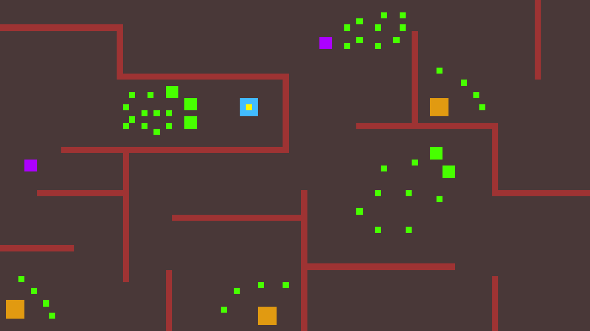

# C.R.A-sion : Crate Mansion

C.R.A-sion : Crate Mansion is a multiplayer code-controlled game using the [PytactX API](https://jusdeliens.com/). In this game, you'll find yourself in a mansion infested by greenish hostile monsters. To help you survive is this chaos, your best friends, the crates, lie in the rooms of the mansion. If you open one of them, you'll find a random weapon that will give you a great advantage over your opponents, which strive to survive in the mansion just like you do.

## Mock-up :
Here what the game could look like :<br>


- In pink, the players.
- In green, the monsters.
- In red, the walls.
- In orange, the crates.
- And in blue, the legendary crate.

## 🎯Context
développé dans le cadre d'une formation, pour un formateur pour monter en compétence en Python ...
## 🎲Rules
maquette, déroulé d'une partie, conditions de victoire
## 🎮Use-cases
- pour l'administrateur : expliquer ce que peut/doit faire un administrateur qui souhaite lancer/administrer une arène de jeu avec des apprenants
- pour le joueur : renvoyer vers README API

## ✅Prerequisites
- matériel et logiciel requis pour executer votre projet, pour l'administrateur
- pour les apprenants rediriger vers README API

## ⚙️Installing the project

To install the project, start by cloning this repository :
```bash
    git clone https://github.com/Frexom/C.R.A-sion
```
Install the dependencies :
```bash
    poetry install
    poetry shell
```
And run the server!
```bash
    python -m src.server.main
```

## 🧪Tests
All methods that could be unit-tested without mocking have been tested.
To launch all tests, run the following command at the root fo the repo :
```bash
    pytest
```
You can also run the `coverage.py` module using the following commands :
```bash
    coverage run -m pytest
    coverage html  #Generate the report
```
## 🛣️Roadmap
## 🧑‍💻Authors
- [@Frexom](https://github.com/Frexom)
- [@YamaXuna](https://github.com/YamaXuna)

## ⚖️Lisence
[GNU AGPLv3](https://choosealicense.com/licenses/agpl-3.0/)


## ⚔️ (Temporaire) Plan d'attaque de la conception du jeu

### 2023-11-13 TD
- [x] Comprendre les bonnes pratiques à utiliser pour votre jeu
- [x] Comprendre les interactions entre les end points d'un jeu robotique réseau
- [x] Définir un groupe de 3-4 personnes
- [x] Créer un projet github et partager les droits à toute l'équipe
- [x] Partir de l'API, définir tous les use cases des utilisateurs joueurs sur un readme
- [x] Faire une maquette à insérer dans votre readme (figma, paint, powerpoint ...)
- [x] Lire le champs des possibles de votre arbitre sur tutos.jusdeliens
- [x] Définir et répartir les tâches dans un kanban (trello ou issues sur github)
- [ ] Rédiger le diagramme de séquence pour chaque use case

### 2023-11-14 TD
- [ ] Choisir interface/méthodes de votre API en Python
- [ ] Réaliser les tests unitaires et fonctionnels de l'API
- [ ] Noyau du serveur pytactX : définir les responsabilités du jeu et les classes évènements et méthodes associées
